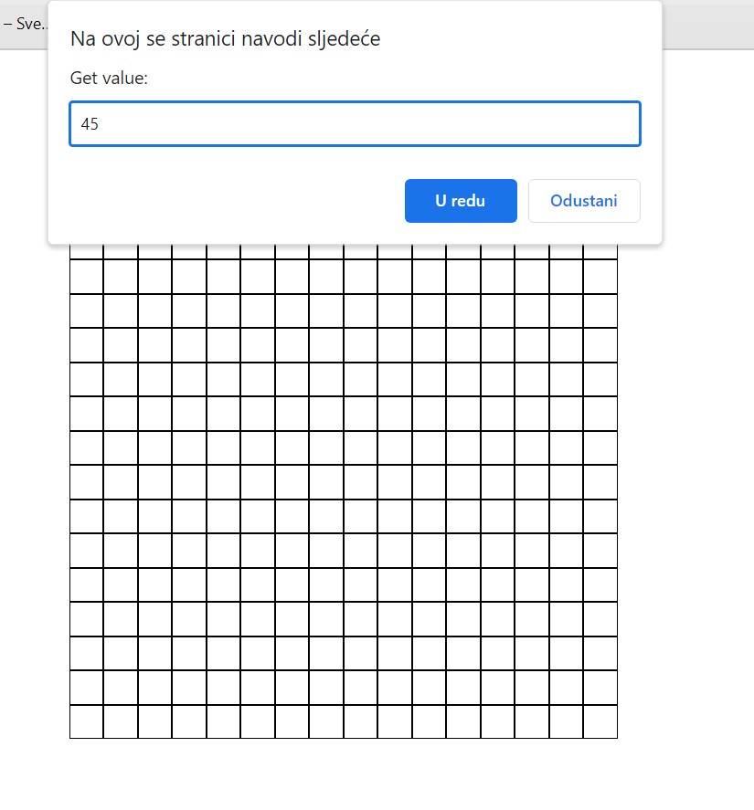
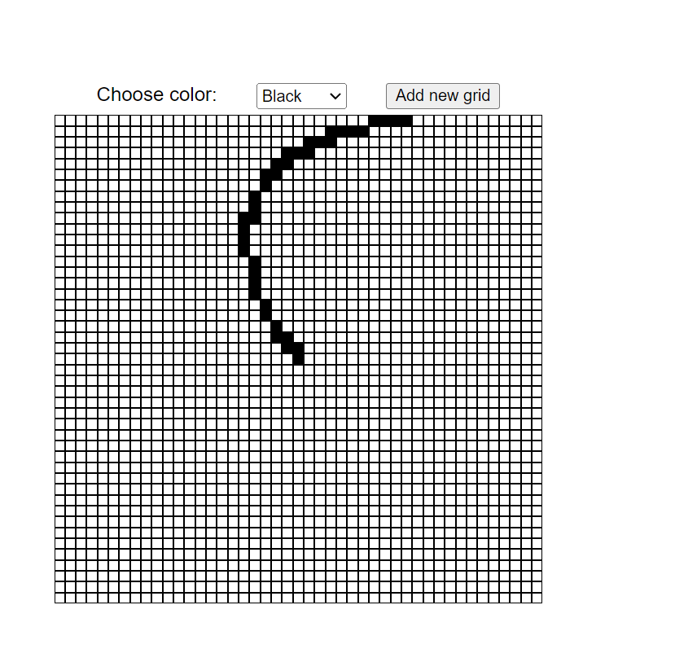
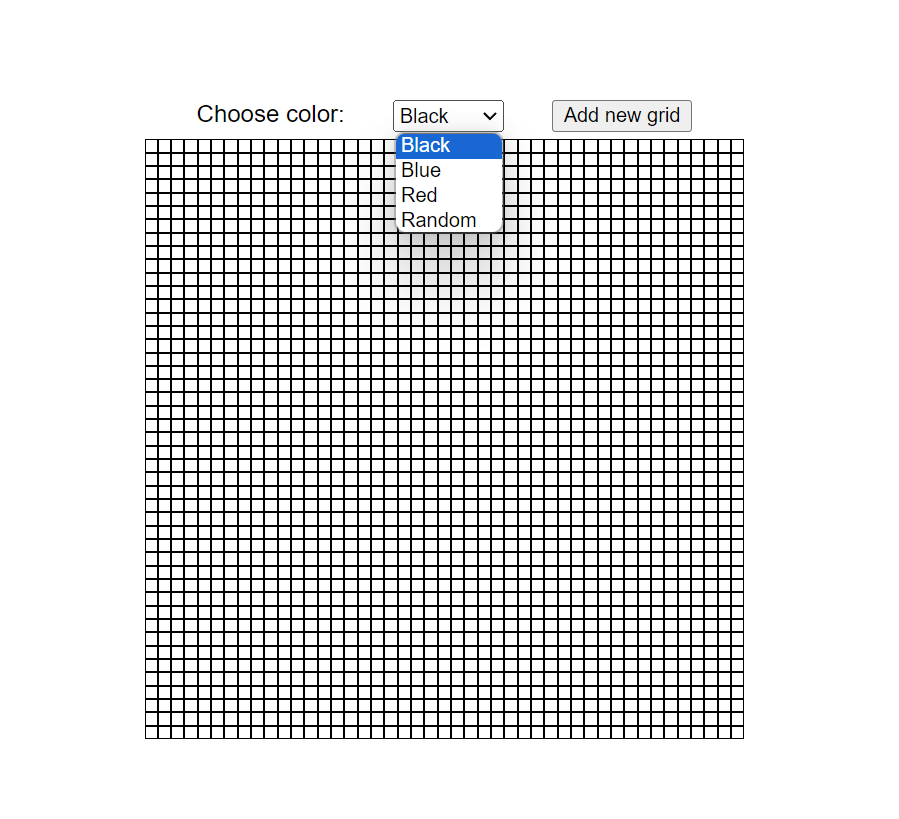
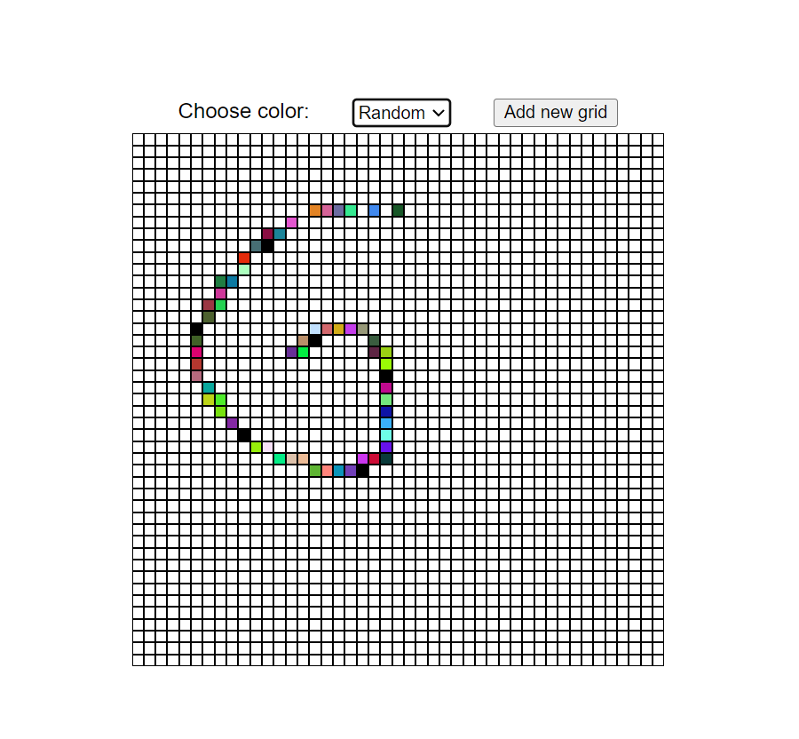

# Etch a sketch (Javascript)

Drawing board (etch a sketch) written in javascript

## Project

### User can select grid output and color

1. 


2. 



3. 



4. 



5. 



### If random color is selected every 10th square will be black

```js
if(select.options[select.selectedIndex].value==='rgb'){
        let counter=0;
        gridEl.forEach(gridel=>{
            gridel.addEventListener('mouseover',()=>{
                counter++;
                const arr=[];
                for(let i=0;i<3;i++){
                    arr[i]=Math.floor(Math.random()*256);
                }
                gridel.style.backgroundColor=`rgb(${arr[0]},${arr[1]},${arr[2]})`
                if(counter===10){
                    counter=0;
                    gridel.style.backgroundColor='black';
                }
            })
        });
    }
```
